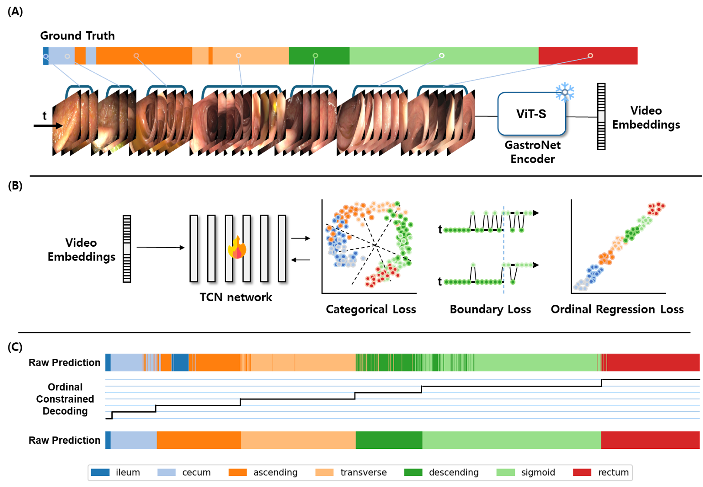

# Ordinal Priors for Colonoscopy Temporal Segmentation

Official implementation of "Ordinal Priors for Colonoscopy Temporal
Segmentation" (MICCAI 2026).



OColT performs seven-class temporal segmentation of colonoscopy videos from
5-fps GastroNet embeddings.

The workflow is embedding extraction, REAL-Colon training and validation, and
then independent testing on REAL-Colon and CAS-Colon.

## Datasets

This project utilizes publicly available colonoscopy datasets:

- [REAL-Colon](https://www.nature.com/articles/s41597-024-03359-0)
- [CAS-Colon](https://www.nature.com/articles/s41597-025-05588-3)

## Installation

```bash
python -m venv .venv
source .venv/bin/activate
pip install -r requirements.txt
```

## Pretrained model

Download `OColT.pth` from [Google Drive](https://drive.google.com/file/d/1I79nmHlSJvil4KXSXulPdoFZBc_d4TzK/view?usp=sharing)
and place it at `checkpoints/OColT.pth`.

## Embedding extraction

Use the GastroNet ViT-S weights described by Boers et al. [1].

```bash
python -m ocolt.extract_embeddings video \
  --video-list VIDEO_LIST.txt \
  --video-dir VIDEO_DIR \
  --out-dir PKL_DIR \
  --encoder-checkpoint GASTRONET_VITS.pth \
  --device cuda:0
```

For frame folders with per-video CSV manifests, use the `frame-manifest`
subcommand instead of `video`.

## Training and validation

Training uses the REAL-Colon training split and selects `OColT.pth` on the
REAL-Colon validation split.

```bash
python -m ocolt.train \
  --config configs/OColT_20260201.yaml \
  --pkl-dir REAL_PKL_DIR \
  --gt-dir REAL_GT_DIR \
  --train-video-list splits/real_train.txt \
  --val-video-list splits/real_val.txt \
  --device cuda:0 \
  --output-dir training_output
```

The selected checkpoint is saved as `training_output/OColT.pth` and can be
passed to either test command below.

## REAL-Colon test

```bash
python -m ocolt.evaluate real \
  --config configs/OColT_20260201.yaml \
  --checkpoint checkpoints/OColT.pth \
  --pkl-dir REAL_PKL_DIR \
  --gt-dir REAL_GT_DIR \
  --video-list splits/real_test.txt \
  --device cuda:0 \
  --output-dir results/real
```

## CAS-Colon test

```bash
python -m ocolt.evaluate cas \
  --config configs/OColT_20260201.yaml \
  --checkpoint checkpoints/OColT.pth \
  --pkl-dir CAS_PKL_DIR \
  --label-csv CAS_VIDEO_LABEL.csv \
  --video-list splits/cas_test.txt \
  --device cuda:0 \
  --output-dir results/cas
```

## References

1. Boers et al., [Foundation models in gastrointestinal endoscopic AI: Impact
   of architecture, pre-training approach and data efficiency](https://doi.org/10.1016/j.media.2024.103298),
   *Medical Image Analysis*, 2024.
2. Biffi et al., [A Temporal Convolutional Network-Based Approach and a
   Benchmark Dataset for Colonoscopy Video Temporal Segmentation](https://arxiv.org/abs/2502.03430),
   2025.

## Acknowledgements

OColT builds on the training framework provided by the
[TSColon/ColonTCN temporal segmentation repository](https://github.com/cosmoimd/temporal_segmentation).
We thank the authors for making their excellent work and training code publicly available.
